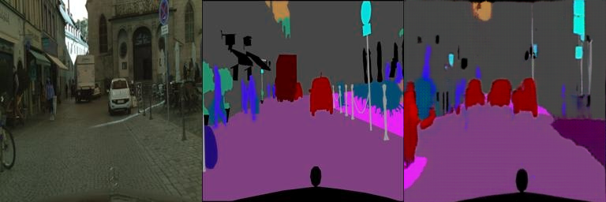

# **Pix2PixGAN**

* 논문

    [Image-to-Image Translation with Conditional Adversarial Networks](https://arxiv.org/pdf/1611.07004.pdf). 

* **cityscapes** Training DB 로 100 epoch 학습한 후 Test DB로 평가한 결과

    *   Image -> Ground Truth -> Generated Image

         
         

         

         
         

